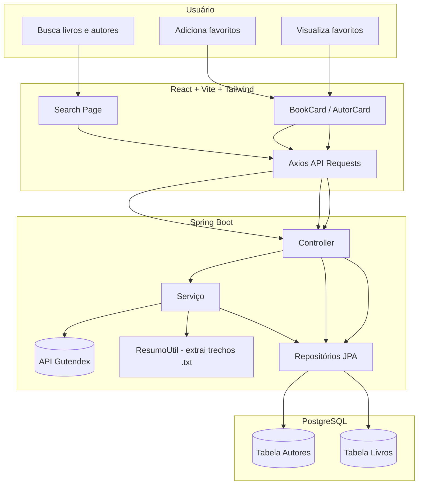
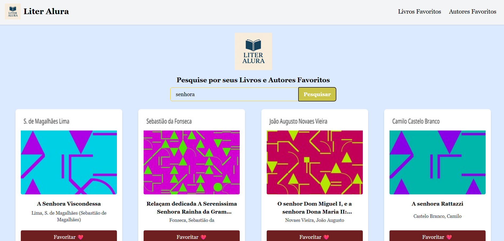

# LiterAlura

**LiterAlura** é uma aplicação full-stack desenvolvida para buscar, favoritar e explorar livros clássicos da literatura mundial usando a API do [Project Gutenberg (Gutendex)](https://gutendex.com/).

### O projeto é dividido em duas partes:

* **Frontend**: Desenvolvido com React + TypeScript + TailwindCSS
* **Backend**: Desenvolvido com Java + Spring Boot + PostgreSQL

---

##  Funcionalidades

### 📖 Leitores (Frontend)

* Buscar livros por título ou autor
* Adicionar livros aos favoritos
* Adicionar autores aos favoritos
* Visualizar lista de livros e autores favoritos
* Ver resumos reais dos livros (extraídos diretamente do texto das obras)
* Layout responsivo e intuitivo desenhado no Figma

### 🚀 Administração (Backend)
[Repositório Backend](https://github.com/Priscila-Santos/LiterAlura_BackEnd.git)
* Integração com a API do Gutendex para consulta de livros
* Extração automática de resumos a partir do `.txt` das obras
* Armazenamento de livros e autores favoritos no banco de dados
* Remoção de favoritos

---

## ⚙️ Tecnologias Utilizadas

### Frontend

* [React](https://reactjs.org/) + [Vite](https://vitejs.dev/)
* [TypeScript](https://www.typescriptlang.org/)
* [Tailwind CSS](https://tailwindcss.com/)
* Axios para consumo de APIs

### Backend

* [Java 17+](https://www.oracle.com/java/technologies/javase/jdk17-archive-downloads.html)
* [Spring Boot](https://spring.io/projects/spring-boot)
* PostgreSQL como banco de dados relacional
* `RestTemplate` / `HttpURLConnection` para chamadas externas

### View

* Figma para prototipagem das páginas e UX/UI. [Link do Projeto no Figma](https://www.figma.com/design/FUy7Qur7Uk8TOqMh8bMVO0/LiterAlura?node-id=0-1&t=Y4FfOUgkIRlXC0AG-1)


---

##  Como Rodar o Projeto Localmente

### 1. Clone o Repositório

```bash
git clone https://github.com/seu-usuario/literalura.git
cd literalura
```

### 2. Rodando o Backend (Spring Boot)

```bash
cd backend
./mvnw spring-boot:run
```

* Certifique-se que o PostgreSQL esteja rodando
* Configure `application.properties` com os seus dados do banco

### 3. Rodando o Frontend (React)

```bash
cd frontend
npm install
npm run dev
```

---

## 🛎 Deploy

### 🍃  Backend (Spring Boot)

#### 1. Faça deploy gratuito no [Render](https://render.com/):
* Crie um novo serviço Web
* Escolha o repositório com a branch do backend
     
#### 🐳 2. Crie os Dockerfiles
##### 📦 backend/Dockerfile
   ```dockerfile
     FROM eclipse-temurin:17-jdk
      ARG JAR_FILE=target/*.jar
      COPY ${JAR_FILE} app.jar
      ENTRYPOINT ["java", "-jar", "/app.jar"]
   ```

### 🌐 Frontend (Vite + React)

1. Faça deploy gratuito na [Vercel](https://vercel.com/)

    * Crie um novo projeto com o repositório
    * Configure as variáveis de ambiente, incluindo `VITE_API_BASE_URL`

---

## 📄 Estrutura de Pastas

```
literalura/
├── backend/                # Aplicativo Spring Boot
├── frontend/               # Aplicativo React
└── docs/                   # Protótipos no Figma 
```

---

## Diagrama


## 🎯 Diferenciais

* ✨ Interface feita no Figma
* ✍️ Resumos reais extraídos de arquivos `.txt` das obras (via HTTP)
* 📉 Backend preparado para escalar
* ☕ Projeto didático ideal para estudos em Java + Frontend moderno

---

##  Créditos e Prototipagem

* As telas foram planejadas no [Figma](https://www.figma.com/design/FUy7Qur7Uk8TOqMh8bMVO0/LiterAlura?node-id=0-1&m=dev), com foco em acessibilidade, responsividade e usabilidade.



---

##  Contribuição

Pull requests são bem-vindos! Sinta-se livre para sugerir melhorias ou corrigir bugs.

---


